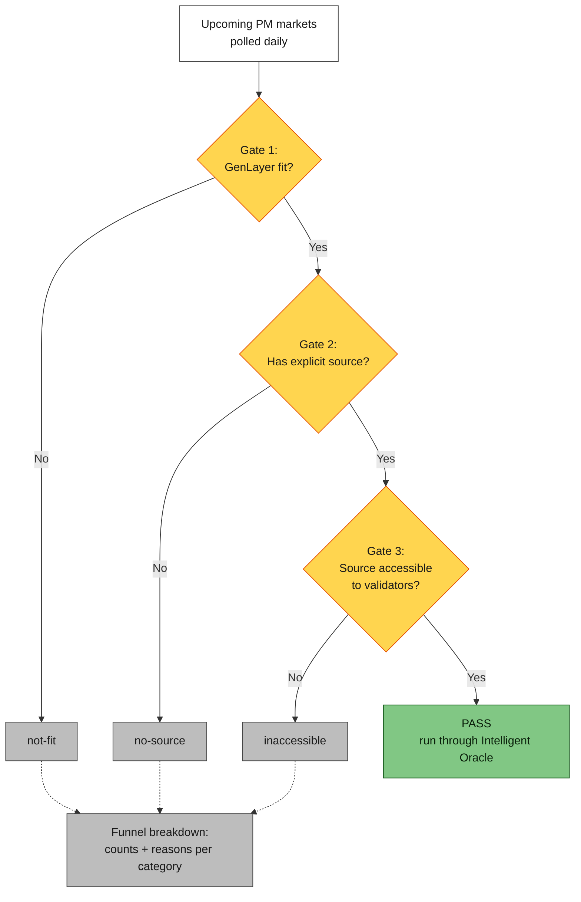

# Intelligent Oracle and GenLayer Gym Roadmap

**Status:** DRAFT
**Author:** Albert Martinez
**Date:** 2026-05-05

---

## 0. TL;DR

Two benchmarks plus one umbrella, all feeding Intelligent Oracle (`intelligentoracle.com`).

1. **Polymarket benchmark.** Continuous monitor of upcoming PM markets, classifying each on GenLayer fit and IO addressability. PASS markets run through IO and get graded against Polymarket's settlement.
2. **Sources benchmark.** Versioned dataset of web sources labeled accessible / partial / blocked + reason. Starts with newspapers, expands to the sources PM markets actually depend on.
3. **GenLayer Gym** (`gym.genlayer.foundation`). W&B-style home for every benchmark, dataset, leaderboard, and run log. The two benches above are its v1 inhabitants.

Goal: know which markets and which sources IO can serve, where it breaks, where to invest next.

---

## 1. Polymarket Benchmark

### 1.1 Aim

Continuously classify all upcoming Polymarket markets on (a) IO addressability and (b) GenLayer fit. Run the PASS markets through Intelligent Oracle and check whether it works.

### 1.2 How

Three gates funnel the upcoming-markets universe down to an addressable set. Rejected markets are not lost — they flow into the funnel breakdown so we can see where coverage is bleeding.

Gate semantics:

- **Gate 1 — GenLayer fit?** Reject markets already served by deterministic oracles (Chainlink-resolvable) or pure on-chain settlement. No GenLayer value-add.
- **Gate 2 — Has explicit source?** Reject markets that don't specify (or surface via agentic search) a primary source we can resolve against. We rely on Polymarket's own source criteria; we do not independently judge credibility here.
- **Gate 3 — Source accessible to validators?** Reject markets whose sources are paywalled, IP-blocked, captcha-walled, or login-only. *Possible unblock paths: TLSNotary, market-data feeds, TBD.*

PASS markets are sent to Intelligent Oracle. We record what IO produces and, once Polymarket settles, whether IO got it right.

### 1.3 Approach

End-to-end pipeline, in order. Step 6 runs in parallel with all of the above.

1. **Market polling.** Daily script that pulls Polymarket markets with end date in the next 24h (markets about to be finalized).

2. **Market filtering.** Skill that runs gates 1 and 2 against each polled market — drop chainlink-resolvable / pure on-chain (Gate 1), drop markets without a Polymarket-specified or agentic-searchable source (Gate 2). Output is a `pass` / `not-fit` / `no-source` label and the funnel breakdown.

3. **Launch Intelligent Oracle contract.** For every `pass` market, deploy a dedicated IO resolution contract via the factory pattern — one contract per resolution, isolated from shared-state contention.

4. **Resolve market.** Skill triggered on the market's end date or when Polymarket marks it resolved. Runs agentic search if the source URL is missing or stale, then submits the URL into the IO contract from step 3. Gate 3 (accessibility) surfaces here — sources that validators cannot fetch are labeled `inaccessible` retroactively and dropped from the pass set.

5. **Compare resolutions.** Script that, after Polymarket settles a market (deadline + ~48h, TBD), diffs IO's outcome against Polymarket's and records correctness, latency, and cost.

6. **Review IO implementation.** Parallel workstream. Audit the IO contract — prompts, states, deploy pipeline — and ship fixes against IO as defects surface. Runs continuously alongside steps 1–5; defects feed back into the next IO release.

### 1.4 Out of scope

- Past markets. We do not backfill historical correctness; we grade what we attempt going forward.

---

## 2. Sources Benchmark

### 2.1 Aim

Versioned, queryable dataset of web sources, each labeled accessible / partial / blocked + reason. Consumable by Intelligent Contracts at runtime to know what they can rely on before reaching out.

### 2.2 How

Each source flows through an Intelligent Contract probe and lands in one of three buckets:

- **accessible** — full content reachable from validator infrastructure.
- **partial** — content reachable but degraded. Reason recorded: soft-paywall, JS-rendered subset, headers-only, partial body, etc.
- **blocked** — content unreachable. Reason recorded: IP, captcha, paywall / payment, login, JS-only, robots.txt.

### 2.3 Approach

End-to-end pipeline. v1 ships newspapers; v2 extends with PM-derived sources.

1. **Seed list compilation.** AI-generated list of newspaper articles, one per newspaper, multi-region (Polish, free, paywalled, etc.).

2. **Probe.** An Intelligent Contract fetches each source from validator infrastructure, classifies it `accessible` / `partial` / `blocked`, and writes the label + reason on-chain.

3. **Ground-truth check.** Skill that pulls the same source via off-chain computer-use search and compares the result against what the IC fetched. Confirms the on-chain probe actually got the real content of the source, not a stripped-down or substituted page.

4. **Publish to Gym.** `sources-db` deployed as the Gym dataset. Filterable view by source, category, accessibility status, and block reason.

5. **Extend with PM-derived sources.** Pull every source URL referenced by markets in `pm-bench`. Categorize (news, sports stats, government data, social, on-chain, public APIs). Dedupe against v1. Run the same probe. Merge into `sources-db`.

### 2.4 Out of scope

- Content correctness. We classify reachability, not whether the source's content is true.
- Source ranking / quality scoring. Could become its own bench later; not part of v1.

---

## 3. Intelligent Oracle

### 3.1 What it is

`intelligentoracle.com`. AI-powered oracle dApp on GenLayer. Headline: ~1h finality, <$1 per market. The benchmarks above exist to make those numbers measurable.

### 3.2 In-flight work

- **Wizard rewire** — read from the Gym source catalog; pick a verified source and wire it into a new market in one click.
- **FAQ updates** — surface live numbers from `pm-bench` and `sources-db` so users see the evidence behind IO's claims.
- **Factory pattern for resolutions** (R&D) — each resolution gets its own contract instance, isolated from shared-state contention.
- **IO end-to-end skill (Skill.md)** — Cowork / Claude skill exposing the full IO flow so agents can drive IO without the UI; also unblocks scripted execution of the Polymarket benchmark.

---

## 4. GenLayer Gym

`gym.genlayer.foundation`. Durable home for every benchmark, dataset, leaderboard, and run log. W&B-style: each bench has a versioned dataset, a public leaderboard, inspectable run logs.

---

## 5. TLSNotary Market

TLSNotary lets a third-party Notary participate in a TLS handshake without seeing the plaintext, then attest that a given response really came from a specific server at a specific time. The client redacts what it wants kept private and submits a cryptographic proof of the rest, which an Intelligent Contract can accept as admissible evidence — the IC never fetches the source itself. This unblocks Gate 3 for sources validators cannot reach directly: rate-limited APIs, paywalled or login-walled content, IP-gated dashboards, platforms with no clean public API.

The canonical example is X (Twitter): high-value real-time signal, no usable public API. With TLSNotary, an agent submits a proof of "this exact tweet existed at this timestamp from this account" and the IC resolves on it. The pattern generalizes to any HTTPS API — bank statements, exchange price at a timestamp, gov data behind login, sportsbook lines. Anywhere a source is blocked at Gate 3, TLSNotary is the unblock path.

---

*End of draft.*
